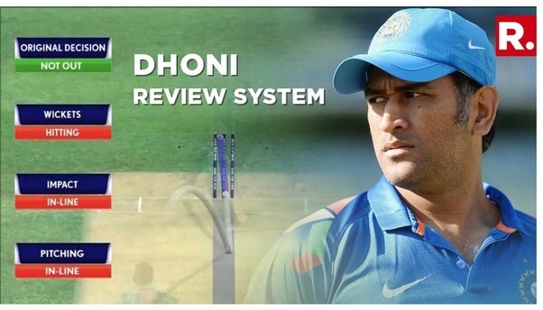
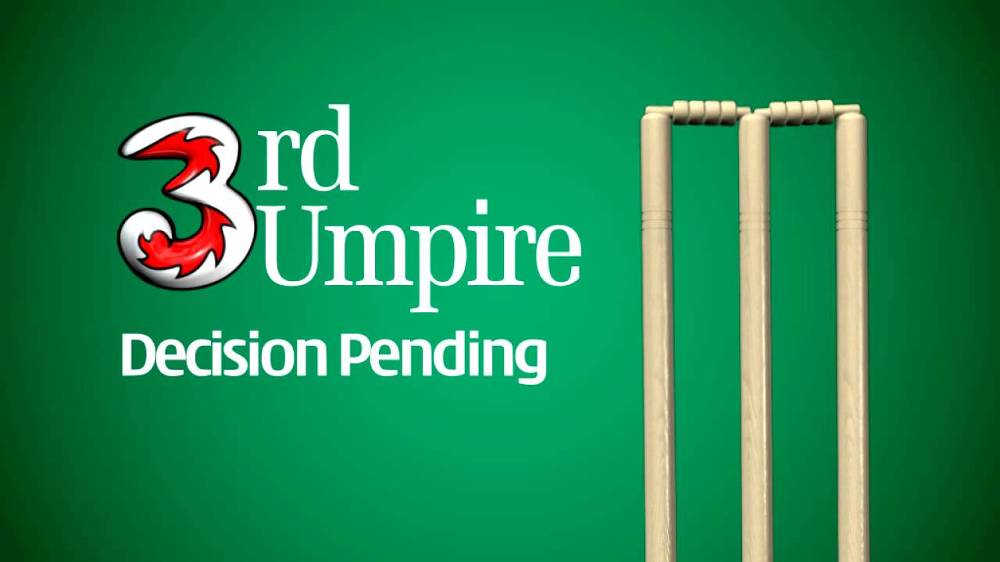
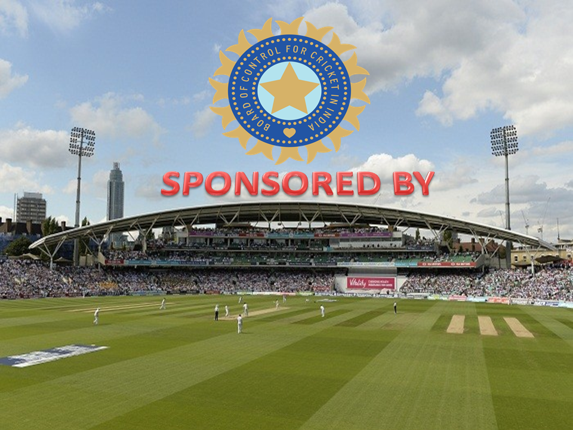

# Decision-Review-System

A Tkinter Based GUI Project to demonstrate
a Gully Cricket Match by providing correct Third Umpire decision whether its related to
* Run Out decision, Edged from bat decision, LBW decision, Caught or not decision, etc.
* It can show the footage in slow or fast motion according to our need and using that we can give the correct decision.
  

  

  

  

  

* Currently we are feeding video to the system after recording
Work can be done ahead..
* To fetch video directly from the camera to this system itself and trimming the part whatever it needs.
